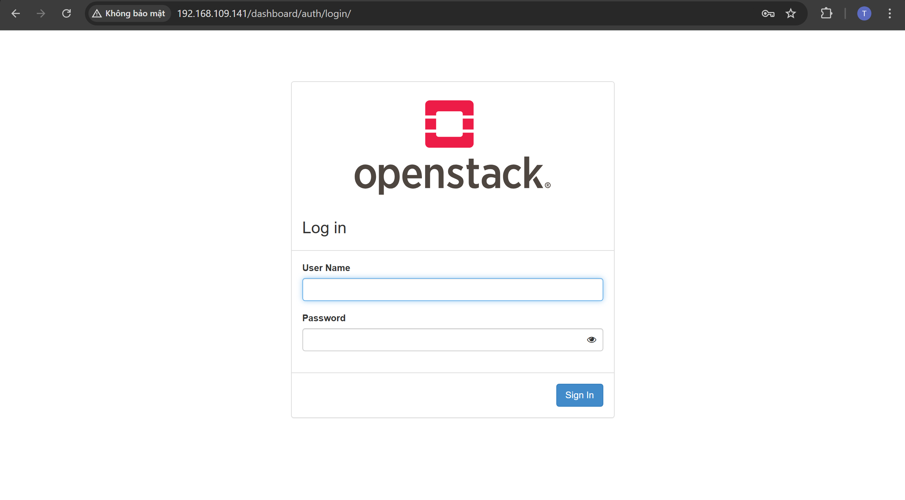

## Cài đặt Openstack Devstack trên Ubuntu 22.04
### 1. Chuẩn bị
#### Chuẩn bị máy ảo (VM)
- Để chạy được devstack trong máy ảo thì cần cung cấp đủ tài nguyên tối thiểu theo khuyến nghị: 8GB RAM, 4 CPU và 80GB ổ cứng.
- Tạo máy ảo Ubuntu 22.04, rồi tiến hành cập nhật phần mềm
```
sudo apt update -y && sudo apt upgrade -y
```
#### Cài đặt
- Tạo user *stack* để chạy devstack
```sh
sudo useradd -s /bin/bash -d /opt/stack -m stack
```
- Cấp quyền thực thi cho tất cả user trong thư mục HOME của stack
```
sudo chmod +x /opt/stack
```
- Thêm quyền privileges cho user *stack*
```
echo "stack ALL=(ALL) NOPASSWD: ALL" | sudo tee /etc/sudoers.d/stack
```
- Chuyển sang user *stack*
```
sudo -u stack -i
```
- Clone repository devstack
```
git clone https://opendev.org/openstack/devstack
```
- **Lưu ý**: Không phải branch nào của devstack cũng hỗ trợ tất cả các bản Ubuntu. Thời điểm hiện tại 16/04/2026, nhánh master không hỗ trợ jammy nữa. Check qua thì thấy nhánh `stable/2024.2` hỗ trợ. Với Ubuntu version khác, hãy check kỹ để không tốn nhiều thời gian.
```
git checkout stable/2024.2
cat ./stack.sh | grep jammy
```
- Tạo file `local.conf`
```conf
[[local|localrc]]
ADMIN_PASSWORD=secret
DATABASE_PASSWORD=$ADMIN_PASSWORD
RABBIT_PASSWORD=$ADMIN_PASSWORD
SERVICE_PASSWORD=$ADMIN_PASSWORD
```
- Tiến hành cài đặt 
```
./stack.sh
```
Sau khi chạy xong thì có thể truy cập horizon thông qua `<IP>/dashboard` với IP là IP của VM.
- Nếu gặp lỗi liên quan đến các service thì hầu như chắc chắn do nhánh hiện tại của devstack không hỗ trợ Ubuntu version. Chọn đúng nhánh, sau đó dọn dẹp lại môi trường vừa tạo.
```
./unstack.sh
./clean.sh
```
- Sau đó tiến hành cài lại
```
./stack.sh
```

### 3. Kết quả
